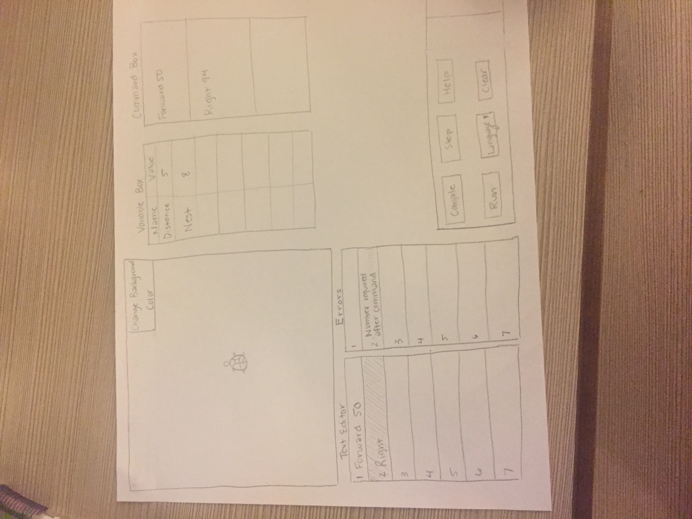

## slogo Team 15

# Team Members:
* George Bernard
* Matthew Faw
* Hannah Fuchshuber
* Kayla Schulz

# Introduction

The problem statement of this design is that of implementing a simplified Logo based coding environment. The primary goals are to implement a wide variety of commands and customization by the user. Another focus of this project is to hone our ability to write API's. Ideally, the API's we write now would be crystallized and then we could extend key pieces or objects passed through those set API's. The primary architecture of the design uses Model-View-Adapter to fully seperate concerns of the front end visualizer and development environment with the syntax and code parsing in the back end. 

# Design Overview

The user interacts directly with a GUI (IDE-like) environment. Upon a compile/code-step interaction, the GUI pings the mediator, which in turn pings a model, which among other updates, builds syntax tree for the instruction. This model, once the directive is completed, updates the mediator, which updates the GUI with the relevant variables, errors, or change in turtle position. The model is composed of multiple controllers which would send a relevant update to the mediator, to better delegate.

The problem we are trying to solve with this program is to create a SLogo IDE.  Our initial goal is to make our design flexible so that new features can be easily added to both the frontend and backend, while maintaining an external API that should not change significantly over the course of the project.

We plan to keep our design flexible in the type of data that is passed back and forth between frontend and backend.  We also aim at allowing new commands to be easily added, and to have new, more sophisticated code outputs without significantly changing our architecture.

Our overall application architecture is Model View Controller.  We plan to use the Observer/Observable design pattern to keep data on frontend and backend consistent.  Primary features such as Commands will be closed for modification by mandating a strict API to which they all conform.  New features will thus be added by implementing these interfaces in different ways.

# User Interface



* Our User Interface will consist of six boxes or areas:
    * The first is the animation or turtle box, that will show the output of the commands input by the user. Inside of the turtle box, the user has a combo box with the option to change the background color. 
    * The text editor will contain the code input by the user. This can be from either the user manually typing the commands, or also from choosing an option from the command box (we will go into further detail on the command box later). If the user is stepping through the program, the last executed line will be highlighted. Additionally, if an error at compile time due to something in the text editor, the line will be highlighted in red. 
    * This transitions in the box adjacent to the text editor: the error box. The error box is a mirror of the text editor box, expect it will only contain text with a compile or run error. At that time, it will populate the box with an error message at the line that caused the error. If the user tries to compile an empty text editor, the first line of the error box will display an error message telling the user to populate the text editor with a command.
    * The variable box will hold the names and values of the defined variables. The user will be able to click into each line in the variable box and update the value. 
    * The box to the right of the variable box is the command box. The command box holds the most recently used (MRU) commands. These will basically be buttons that the user can click that will populate the text editor with a full command. The command box should update each time new code is successfully run. Later down the line, we see the user having the ability to delete each element in the command box at his/her discretion. There would be a little red box with an ‘X’ in the corner of each command that would allow the user to remove that command from the MRU stack. 
    * Finally, the toolbar will contain many of the buttons that allow the user to interact with the program. This will include the run, step, clear, language (combo box), help, and compile buttons.

# API Details

API details are covered sufficiently in the design overview and in the documentation in each interface.


Backend Internal API:


Backend External API:
```
    public interface CodeEvaluator {
    	void buildAST(Code aCodeToEvaluate) throws SyntaxError
    	void evaluateNextLine() throws MissingImplementationError
    	boolean hasNextLine()
    	void setLangauge(Language aLanguage)
    }

    public interface ViewableRobot {
	    int getAngle()
	    int getCurrentPosition()
	    PenMark getPenMark()
	    int getVisibilityValue()
    }

	public interface ViewableEnvironmentInfo {
		Collection<Variable> getEnvironmentVariables()
		Collection<SLogoFunction> getCustomInstructions()
	}
```

# API Example Code

* Front-end Internal API:
* TurtleBox:

```java
public class TurtleBox {

/**
* Returns the root with all components of turtle box
* @return root of the turtlebox
*/
    public Group getRoot() {
        return new Group();
    }
    
   /**
    * Draw the moves from robot over all turtles
    * @param Robot from back-end (this will later be of type robot)
    */
   public void addRobot(Object robot) {
   }
    
   /**
    * Clears the turtle box to its initial settings
    */
   public void clear() {
   }
}
```

    
* Text Editor:
```java
public class TextEditor {
    /**
     * Clear the text editor to its original, empty state
     */
    public void clear() {
        
    }
    
    /**
     * Highlight a line in the text editor - will be used by either
     * step or error
     * @param color - the color to be used when highlighting the line
     * @param line - the line number to be highlighted
     */
    public void highlightLine(Color color, int line) {
        
    }
    
    /**
     * Get the instruction list from the text editor
     * This will occur on run clicked
     * @return instruction list
     */
    public List getInstructionList() {
        return new List();
    }
    
    /**
     * Set the instructions inside of the text editor
     * This will receive its input from the command box
     * @param list of instructions
     */
    public void setInstructionList(List instructions) {
        
    }
}
```


When the Run code button is pressed:
```
AppController.onRunButtonPressed(String aCode) is triggered
CodeEvaluationController.evaluateCode(Code aCodeToEvaluate)
CodeEvaluator.buildAST(Code aCodeToEvaluate)
Collection<SyntaxObjects> syntaxObjs = TextParser.parseCode(Code aCodeToEvaluate)
AbstractSyntaxTree.buildTree(syntaxObjs)

CodeEvaluator.evaluateNextLine() // until no more instructions to execute
AbstractSyntaxTree.evaluateNextNode()
Node.evaluateMethod()
//private
Collection<MethodInput> inputs = Node.getMethodInputs()
//for each input child, get the value of the node, and add that value to the method inputs collection
// use the command field of the node to produce the return value of the method
Node.fCommand.evaluate(inputs)

```

TODO: How to handle custom methods

# Design Considerations
* Before the team can come to a complete design solution, we need to reach a consensus on what specific information will be passed between the front-end and the back-end. We have discussed passing one object back and forth through the controller, allowing for flexibility in what is included in the object and later extension.

# Team Responsibilities
* We split the team into two parts as recommended: front-end and back-end. Matthew and Hannah will be responsible for the back-end while George and Kayla will be responsible for the front-end. 
In splitting up front-end, George and Kayla will do some pair programming to begin the creation of the sub-components of the view. In terms of individual responsibilities
though, George will handle more of the controller implementation and the communication between the front-end and the back-end. Kayla will work on more of the visual components and the overall appScene class that combines all sub-components of the view into one synchronized window.
